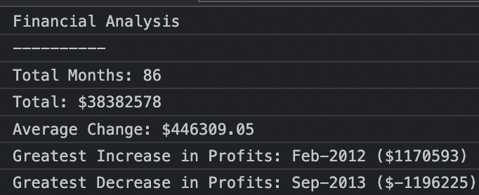

# Console-Finances

* [Description](#description)
* [Usage](#usage)
* [Screenshots](#screenshots)
* [License](#license)

## Description

## Usage
Open index.html and use Inspect Element/browser tools to view the JavaScript console output.
Or open in [GitHub Pages](https://robh95.github.io/console-finances/)

## Screenshots

## License
MIT license - included in LICENSE
